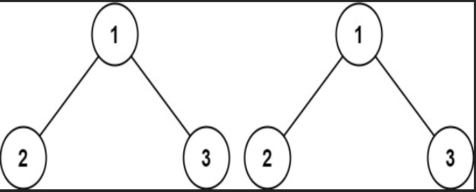
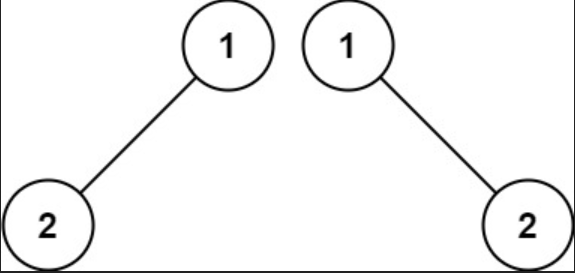
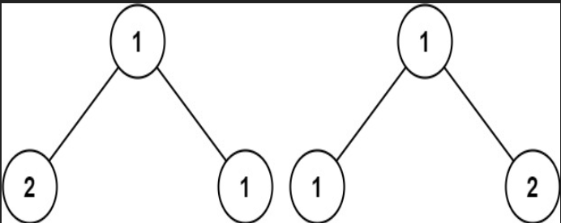

# 100.相同的树

## 题目描述

给你两棵二叉树的根节点 `p` 和 `q` ，编写一个函数来检验这两棵树是否相同。

如果两个树在结构上相同，并且节点具有相同的值，则认为它们是相同的。

**示例一**



```ts
输入：p = [1,2,3], q = [1,2,3]
输出：true
```

**示例二**



```ts
输入：p = [1,2], q = [1,null,2]
输出：false
```


**示例三**




```ts
输入：p = [1,2,1], q = [1,1,2]
输出：false
```


## 解题思路

首先这是一道二叉树的题目，从题目中可以得知，需要判断两颗二叉树是否一致。也就是说，可以通过树的深度遍历，来判断两棵树的节点和值是否一致


### 编码

```ts
/*
 * @lc app=leetcode.cn id=100 lang=typescript
 *
 * [100] 相同的树
 */

// @lc code=start
/**
 * Definition for a binary tree node.
 * class TreeNode {
 *     val: number
 *     left: TreeNode | null
 *     right: TreeNode | null
 *     constructor(val?: number, left?: TreeNode | null, right?: TreeNode | null) {
 *         this.val = (val===undefined ? 0 : val)
 *         this.left = (left===undefined ? null : left)
 *         this.right = (right===undefined ? null : right)
 *     }
 * }
 */

function isSameTree(p: TreeNode | null, q: TreeNode | null): boolean {
  // 如果不存在
  if (!p && !q) return true;
  // 对比两棵树是否相同节点
  if (!p || !q) return false;
  if (p.val !== q.val) return false;
  return isSameTree(p.left, q.left) && isSameTree(p.right, q.right);
};
```

