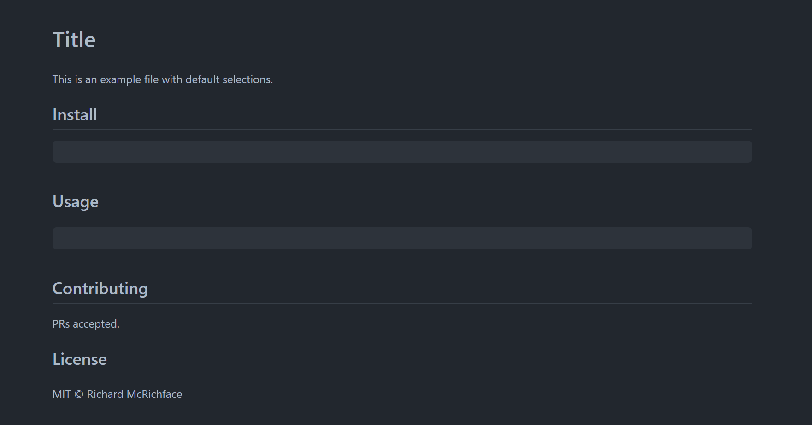

## 问题

### 分析一下目录
> 所有的目录请查看[这里](./cac.dialog.md)

-   什么类型的文件放到什么文件夹内
> 根目录：一般有`node_modules,src,scripts,各种项目配置文件,`等
> node_modules: 依赖包
> src： 一般放入核心的功能模块
> scripts: 脚本文件
> example: 示例文件
> .githup: github相关文件
-   一般都会有几个文件夹
>  5个


### .editorconfig 是干嘛的
> 让使用不同编辑器的开发者在共同开发一个项目时，处理不同编辑器带来的差异

### .gitattributes 是干嘛的

>  每当一个文件被创建或保存，git 会按照这些属性所指定的自动化的保存文件,处理不同操作系统直接文档格式带来的差异

### 持续集成是如何实现的

> 使用 circle 实现持续集成

-   circle.yml 是如何配置的

> 请查看这篇文章 [介绍配置](https://circleci.com/docs/config-intro)


### 分析一下单元测试环境是如何搭建的

> 1. 安装`jest`， `ts-jest`的依赖
> 2. 建立`jest.config.js `来配置对应的依赖
> 3. 在`src`下面建立 `__test__`文件夹，然后在里面写对应的测试用例
> 4. 最后在`package.json`中写上对应的指令 如： ` "test": "jest","test:cov": "jest --coverage"`

-   ts-jest 是解决什么问题的
    > 在`jest`测试代码中无法使用ts语法，`ts-jest`是用于转换ts语法并且可以生成`source map`

    -   如果没有 ts-jest 的话 你会搭建基于 ts 的 jest 的环境嘛？

        -   写个 demo？
        ```ts
        安装babelnpm install --save-dev @babel/preset-typescript
        然后将 @babel/preset-typescript 添加到 babel.config.js 中的 presets 列表中
        module.exports = {
          presets: [
            ['@babel/preset-env', {targets: {node: 'current'}}],
            '@babel/preset-typescript',
          ],
        };

        ```
        

-   分析一下 jest.config.js 这几个字段都有什么用？
```ts
module.exports = {
  testEnvironment: '选择当前的测试环境',
  transform: {  // 可以在测试代码中使用的转换器
    '^.+\\.tsx?$': 'ts-jest' // 对 ts，tsx 的文件使用ts-jest转换
  },
  testRegex: '(/__test__/.*|(\\.|/)(test|spec))\\.tsx?$', // 需要测试的文件
  testPathIgnorePatterns: ['/node_modules/', '/dist/', '/types/'], // 忽略测试的文件
  moduleFileExtensions: ['ts', 'tsx', 'js', 'jsx', 'json', 'node'] // 支持的文件类型
}

```

### 分析一下 package.json 里面的字段都是干嘛的
> 所有的字段[这里](./package.md)

-   发布一个库需要用到哪些字段
   > 1. name: 库的名称
   > 2. version: 库的版本
   > 3. description: 库的描述
   > 4. author: 库的作者
   > 5. license: 库的许可证
   > 6. main: 库的入口文件
   > 7. module: 库的模块化文件
   > 8. types: 库的类型文件
   > 9. bin: 库的命令行文件
    > 10. scripts: 库的脚本文件
    > 11. repository: 库的仓库地址
    > 12. keywords: 库的关键字
    > 13. dependencies: 库的依赖
    > 14. devDependencies: 库的开发依赖
    > 17. engines: 库的引擎版本

### 写一个库的 README 需要哪几个部分？

`Title,Install, Usage, Contributing, License`

-   结构是什么样子的？
  
  > 上面是最小的模板，还有最大的 [like as](./max-readme-temp.md)

-   有哪些可以快速生成 readme 的库
  >  [readme-md-generator]('https://www.npmjs.com/package/readme-md-generator')

    -   可以记录下来，下次一起分析是如何做到的

### 构建是如何做的？

-   分析 rollup.config.js
```ts
//写了一个创建rollup.config配置的函数
/**
 * @param dts 是否需要生成类型文件
 * @param esm 打包的方式是否是esm
 */
function createConfig({ dts, esm } = {}) {
  let file = 'dist/index.js'
  // 生成类型检查文件的入口
  if (dts) {
    file = file.replace('.js', '.d.ts')
  }
  // 生成esm文件的入口
  if (esm) {
    file = file.replace('.js', '.mjs')
  }
  return {
    // 入口
    input: 'src/index.ts',
    // 出口
    output: {
      // 打包的格式
      format: dts || esm ? 'esm' : 'cjs',
      // 出口
      file,
      // cjs 对外导出的name
      exports: 'named',
    },
    plugins: [
      // 解析项目中的import第三方的内容
      nodeResolvePlugin({
        // 使用package.json中的入口
        mainFields: dts ? ['types', 'typings'] : ['module', 'main'],
        // 对应的模式下处理对应的文件类型
        extensions: dts ? ['.d.ts', '.ts'] : ['.js', '.json', '.mjs'],
        // 自定义模块
        customResolveOptions: {
          moduleDirectories: dts
            ? ['node_modules/@types', 'node_modules']
            : ['node_modules'],
        },
      }),
      // 转换commonjs的包到esm格式
      !dts && require('@rollup/plugin-commonjs')(),
      // 解析ts
      !dts &&
        esbuildPlugin({
          target: 'es2017',
        }),
       // 生成类型文件
      dts && dtsPlugin(),
    ].filter(Boolean),
  }
}
```

### 分析一下 tsconfig 里面的配置项
```ts
{
  "compilerOptions": {  //编译选项
    "target": "es2015",    // ts最后编译的目标环境
    "declaration": true,    // 是否生成声明文件 .d.ts
    "declarationDir": "types",   // 生成.d.ts的目录
    "esModuleInterop": true,    // 启用es模块交互，commonjs导入到ts中增加辅助函数
    "pretty": true,      // 启用报错后代码格式和颜色的输出，方便查看
    "moduleResolution": "node",  // 使用node的模块解析策略
    "lib": ["es2015", "es2016.array.include"],   // ts的库环境
    "allowSyntheticDefaultImports": true,   // 允许模块导入，当模块没有默认导出
    "stripInternal": true,  // 禁用文档中使用@internal注释生成类型文件
    "noImplicitAny": true,   // 不允许隐士的any
    "noImplicitReturns": true,   // 不允许隐士的return
    "noImplicitThis": true,    // 不允许隐士的this
    "noUnusedLocals": true,    // 不允许局部变量定义不使用
    "noUnusedParameters": true,   // 不允许参数定义而不使用
    "noFallthroughCasesInSwitch": true,   // 不允许switch中不写break;
    "strictNullChecks": true,     // 启用严格的null检查
    "strictFunctionTypes": true,   // 严格的函数类型检查
    "strictPropertyInitialization": true,   // 启用严格属性初始化检查
    "alwaysStrict": true,     // 启用use strict
    "module": "commonjs",  // esm模块代码格式是commonjs
    "outDir": "lib"     // 编译后输出的目录
  },
  "include": ["src", "declarations.d.ts"],  // 需要进行ts检查的目录/文件
  "exclude": ["src/deno.ts"]  // 不需要检查的目录/文件
}

```

### 画一下这个库的程序流程图

-   画流程图可以参考这篇文章 <https://zhuanlan.zhihu.com/p/364507517>

-   画好了图之后可以更清晰明了的看到程序设计的全貌

-   划分好类的职责

    -   CAC
    -   Command
    -   Option

-   可以画一下 UML图

### 尝试通过单元测试调试库

-   可以把你通过单元测试调试库的过程记录下来
-   让别人可以基于你的记录也可以实现

### 这个库应该如何使用？

-   基于这个库的文档写一篇小教程
-   让别人基于你的教程就可以使用这个库

### 如何理解 option

-   概念
-   在程序里面是如何实现的

### 如何理解 command

-   概念
-   在程序里面是如何实现的

### 如何理解 action

-   概念
-   在程序里面是如何实现的

### 如何实现连续调用的api


### Brackets 应该如何使用

-   方括号和尖括号有什么不同

### Brackets 是如何实现的

### Negated Options 是如何实现的？

### 分析一下下面这段代码的执行流程


### 还可以从功能上分解需求点

-   全局的 command 是如何实现的
-   sub command 是如何实现的
-   每个 command 的 option 是如何实现的
-   help 和 version 是如何实现的

### 程序等于数据结构＋算法

-   哪一部分是收集数据的

    -   对应初始化的逻辑

-   哪一部分是算法
