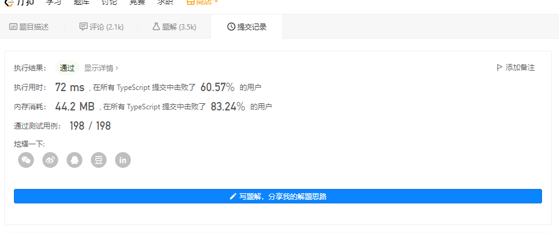
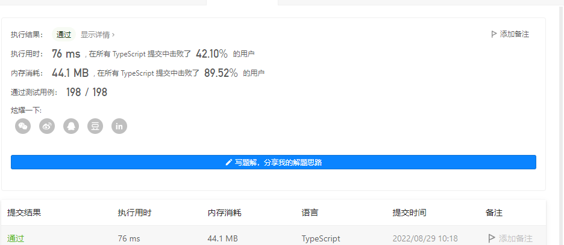

# 101.对称二叉树


## 题目描述

给你一个二叉树的根节点 `root` ， 检查它是否轴对称。

**示例一：**


```ts
输入：root = [1,2,2,3,4,4,3]
输出：true
```

**示例 2：**


```ts
输入：root = [1,2,2,null,3,null,3]
输出：false
```

## 分析

这是一道二叉树的题目，判断一棵树是否是二叉树，需要通过树的左右叶子节点来进行对比。所以解决的四路有两种方式：

1. 递归的方式
2. 迭代的方式


## 解题

### 递归

这棵树只会给一个跟节点，但是要求的需要对比左右节点，所以可以在函数的内部再来一个函数，来进行递归处理节点。


```ts
/*
 * @lc app=leetcode.cn id=101 lang=typescript
 *
 * [101] 对称二叉树
 */

// @lc code=start
/**
 * Definition for a binary tree node.
 * class TreeNode {
 *     val: number
 *     left: TreeNode | null
 *     right: TreeNode | null
 *     constructor(val?: number, left?: TreeNode | null, right?: TreeNode | null) {
 *         this.val = (val===undefined ? 0 : val)
 *         this.left = (left===undefined ? null : left)
 *         this.right = (right===undefined ? null : right)
 *     }
 * }
 */

function isSymmetric(root: TreeNode | null): boolean {
    if(!root) return true;
    // 判断左右节点是不是一样的
    const _isSymmetric = (left:TreeNode | null, right: TreeNode | null) =>{
        // 左右两边哪个点击不存在都是false
       if((!left && right) || (left && !right)){
           return false;
       } 
       else if(left && right){
           if(left.val !== right.val){
               return false
           }else{
               // 这里需要注意，由于是对称的树，肯定是两侧进行对比
               return _isSymmetric(left.left, right.right) && _isSymmetric(left.right, right.left)
           }
       }else{
           return true
       }
    }
    
    return _isSymmetric(root.left, root.right)
}
```


#### 执行的结果



### 迭代

众所周知，递归是比较消耗性能的。那能用递归来解决的问题，大部分也可以用迭代来解决,那就一起来看看，本题如何用迭代来实现吧！！！

```ts
/*
 * @lc app=leetcode.cn id=101 lang=typescript
 *
 * [101] 对称二叉树
 */

// @lc code=start
/**
 * Definition for a binary tree node.
 * class TreeNode {
 *     val: number
 *     left: TreeNode | null
 *     right: TreeNode | null
 *     constructor(val?: number, left?: TreeNode | null, right?: TreeNode | null) {
 *         this.val = (val===undefined ? 0 : val)
 *         this.left = (left===undefined ? null : left)
 *         this.right = (right===undefined ? null : right)
 *     }
 * }
 */

function isSymmetric(root: TreeNode | null): boolean {
    if(!root) return true;
    const _isSymmetric = (l:TreeNode | null, r: TreeNode | null) => {
        // 用一个数组来装左右叶子节点
        const arr = [l, r];
        while(arr.length){
            // 取出左右叶子节点
           const u = arr.shift();
           const v = arr.shift();
            // 两者都不存在，跳出本次循环
           if(!u && !v)  continue;
            // 二则有一个存在，则不对称
           else if((!u && v) || (u && !v)) return false
           else {
               // 内部不相等，不对称
               if(u.val !== v.val) return false
               else {
                   // 放入对称的节点，继续循环
                   arr.push(u.left, v.right)
                   arr.push(u.right, v.left)
                   
               }
           } 
        }
    // 没有走出false,则是对称二叉树
      return true
    }
    
    return _isSymmetric(root.left, root.right)
}
```

