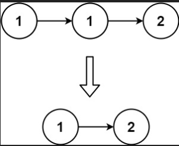
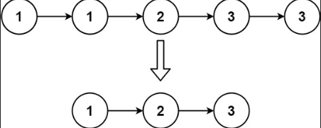

# 83.删除排序链表中的重复元素

## 题目

给定一个已排序的链表的头 `head` ， *删除所有重复的元素，使每个元素只出现一次* 。返回 *已排序的链表* 。

### 示例一



```ts
输入：head = [1,1,2]
输出：[1,2]
```

### 示例二



```ts
输入：head = [1,1,2,3,3]
输出：[1,2,3]
```

# 思路分析

首先这是一道链表的题目，需要返回一个全新的并且不重复的链表。那么肯定需要保存一个新的链表。在保存新的链表之前，需要对传入的链表进行操作。

# 编码

```ts
/*
 * @lc app=leetcode.cn id=83 lang=typescript
 *
 * [83] 删除排序链表中的重复元素
 */

// @lc code=start
/**
 * Definition for singly-linked list.
 * class ListNode {
 *     val: number
 *     next: ListNode | null
 *     constructor(val?: number, next?: ListNode | null) {
 *         this.val = (val===undefined ? 0 : val)
 *         this.next = (next===undefined ? null : next)
 *     }
 * }
 */

function deleteDuplicates(head: ListNode | null): ListNode | null {
  if (head === null || head.next === null) return head;

  let dmy: ListNode = new ListNode(-1, head);
  let curr: ListNode = dmy.next;

  while (curr && curr.next) {
    if (curr.val === curr.next.val) {
      curr.next = curr.next.next;
    } else {
      curr = curr.next;
    }
  }
  return dmy.next;
};
```

