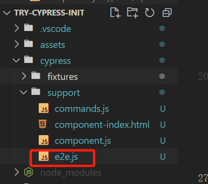
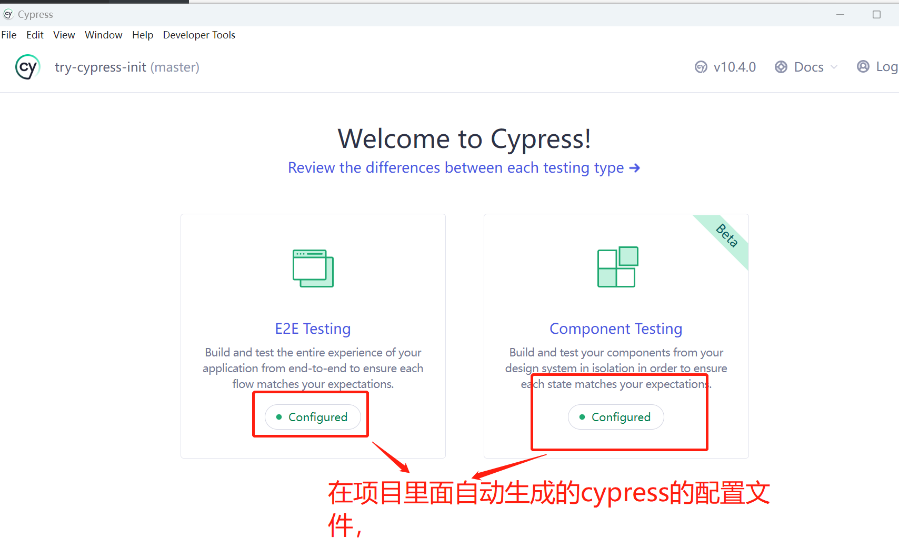
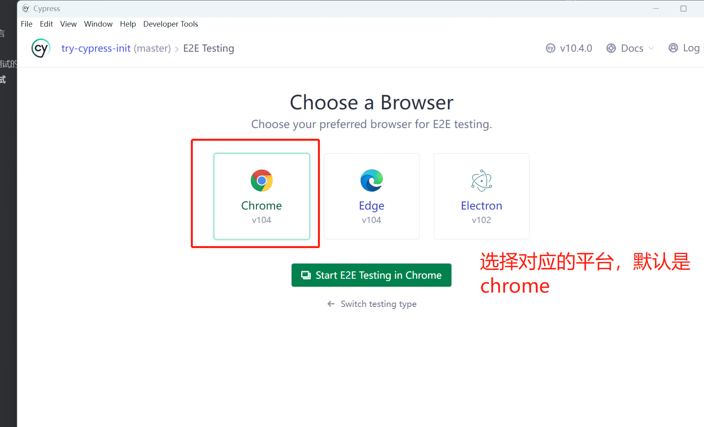
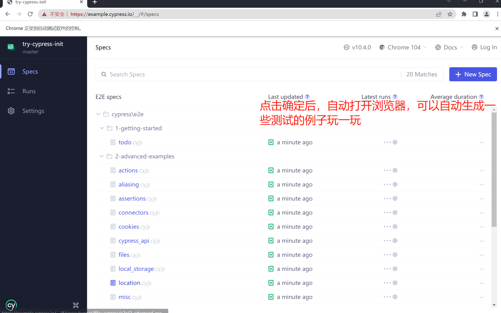
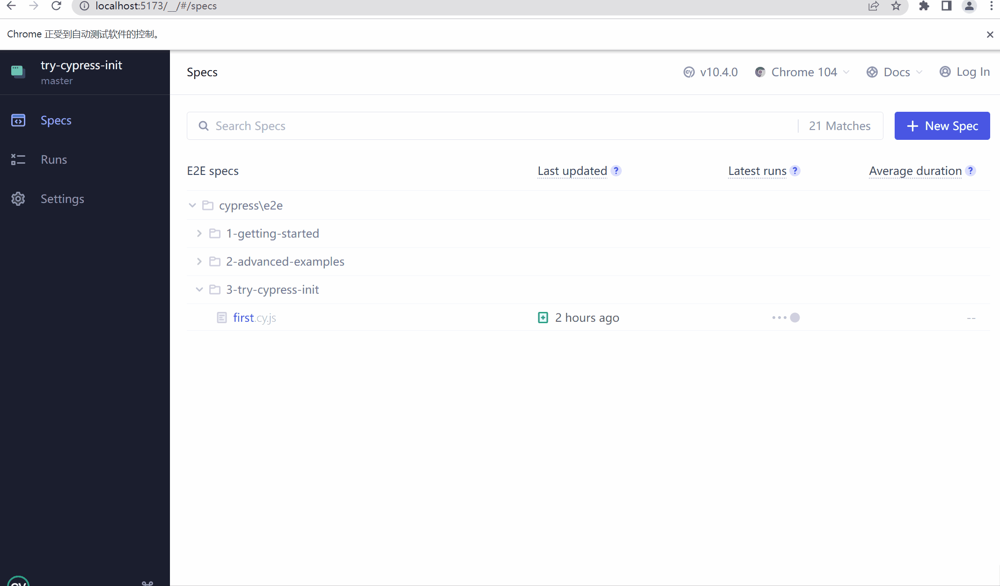
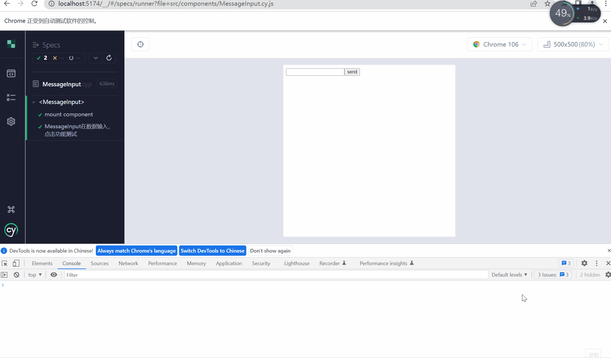
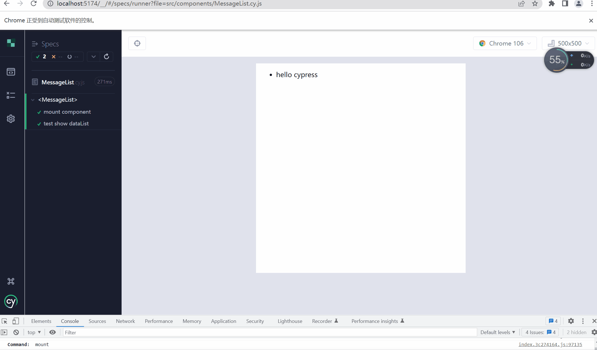

# `cypress` 引言

> `cypress` 是啥，`cypress` 的初衷是**创造一个友好的体验，用于web端的`e2e`测试** 。换一句话说就是，书写测试用例，然后`ui`自动化测试，详情请查看[官网](https://docs.cypress.io/guides/overview/why-cypress)

# 项目搭建

使用`vite`来搭建一个`vue`的项目，在里面使用`cypress`来进行`e2e测试`和`组件测试`

```ts
pnpm create vite try-cypress-init --template vue  // 初始化项目
pnpm add cypress -D  // 安装依赖
```


配置打开cypress的脚本,在`package.json`中增加指令

```json
"scripts":{
    "cy:open": "cypress open"
}
```

启动命令后，就能看到下面的结果


## 选择需要测试的类型

在这里可以选择`E2E`（端到端）的测试，然后点击确定，就会在项目里面生成配置文件，如下：



生成完成后，在控制台会出现配置完成，可以进行测试啦！



### `E2E` 测试启动





在上面的测试用例中，可以点击对应的测试用例，然后`cypress`会自动按照脚本的内容来跑起来。

> `E2E测试`会发现启动的方式很简单，那么对应的组件测试，也是一样的简单。这样就不演示了，等一下来编写对应的组件，来看看效果


# 编写项目测试用例

在开发的过程中，有一种思想叫做`TDD`（测试驱动开发），接下来就使用改思想来开发一个页面。`TDD`的开发思想总共分为三个步骤：

- 编写测试用例
- 让测试用例通过
- 重构

## 编写测试用例

在`src/cypress/e2e`中添加一个文件夹`try-cypress-init`中增加咋们的测试用例，内容如下：

```ts
describe('尝试使用cypress来测试项目', () => {
  // 在窗口打开本地项目的连接
  beforeEach(() => {
    cy.visit('http://localhost:5173')
  })

  it('测试一个小demo', () => {
    // 做一个这样demo, 一个输入框，一个按钮，输入框输入数据后，点击按钮，输入框的内容消息，下面的数据列表展示对应的数据
    // 拿到输入框，输入对应的数据
    cy.get('[data-test=testMessage]').type('hello cypress');
    // 拿到按钮，并且点击按钮
    cy.get('[data-test=testButton]').click();
    // 输入框的值是空
    cy.get('[data-test=testMessage]').should('have.value', '');
    // 下面的数据列表展示对应的数据
    cy.get('[data-test=testList] li').should('have.length', 1);
    // ul li显示的数据
    cy.get('[data-test=testList] li').first().should('have.text', 'hello cypress');
  })
})
```

写完测试用例后，接下来写页面。

## 通过测试用例

为了快速通过代码，咋们就在`app.vue`中来进行书写对应的代码

```vue
<script setup>
import { reactive, ref } from 'vue'
const message = ref('')
const messageList = reactive([])
const send = () => {
  messageList.push(message.value)
  message.value = ''
}
</script>

<template>
  <div class="app-container">
    <div class="operation-container">
      <input type="text" data-test="testMessage" v-model="message" />
      <button data-test="testButton" @click="send">send</button>
    </div>
    <div class="show-container">
      <ul data-test="testList">
        <li v-for="msg in messageList" :key="msg">{{ msg }}</li>
      </ul>
    </div>
  </div>
</template>
<style scoped>
.app-container {
  text-align: center;
}
</style>
```

接下来就是见证奇迹的时刻了🤔🤔🤔



> 点击测试用例，然后就自动测试了。是不是感觉很爽哇！


## 重构

目前是所有的代码都卸载了`App.vue`中，一般来说，可以把对应的功能封装成对应的组件。

封装对应的组件，然后可以使用cypress来测试组件哦！

在这个功能中，总共可以分为两个组件，一个用于输入的组件`MessageInput`，另一个用于展示的组件`MessageList`


# 编写组件测试

## `MessageInput`

功能的话，很简单。只有输入框输入数据，点击按钮，把当前事件对外抛出，并且清空输入框的内容。

### 编码

测试用例的内容可以如下：

```ts
import MessageInput from './MessageInput.vue'
describe('<MessageInput>', () => {
  // 挂载组件
  it('mount component', () => {
    cy.mount(MessageInput)
  })

  it('MessageInput在数据输入，点击功能测试', () => {
    const onMessageInput = cy.spy().as('onMessageInputSpy')
    cy.mount(MessageInput, { props: { onSendMessage: onMessageInput } })
    // 找到input输入内容
    cy.get('[data-test=testMessage]').type('hello cypress');
    // 找到按钮并且点击
    cy.get('[data-test=testButton]').click();
    // 触发事件onSendMessage，并且值是hello cypress
    cy.get('@onMessageInputSpy').should('be.calledWith', 'hello cypress')
    // 验证输入框是否为空
    cy.get('[data-test=testMessage]').should('have.value', '')
  })
})

```

有了对应的测试用例，那来实现下组件的功能。

```vue
<script setup>
import { ref } from "vue"
const message = ref('')
const emits = defineEmits(['sendMessage'])
const send = () => {
  emits('sendMessage', message.value)
  message.value = ''
}
</script>
<template>
  <div class="operation-container">
    <input type="text" data-test="testMessage" v-model="message" />
    <button data-test="testButton" @click="send">send</button>
  </div>
</template>

<style scoped>
</style>

```


### 测试结果



> attention!!!
>
> 在进行组件测试的时候，不能使用 `node17`版本，如果是`17`版本的请减低到`16`版本。17版本会导致组件测试一直处于`loading`状态，无法测试组件


有了第一个功能组件，接下来做一个展示的组件。


## 展示组件

展示组件需要做到的，传入一个list列表，我负责展示即可


### 编码

在测试用例中，只需要在挂载组件的时候传入数据，然后进行页面展示赋值即可

```ts
import MessageList from './MessageList.vue';
describe('<MessageList>', () => {
  it('mount component', () => {
    cy.mount(MessageList)
  })

  it('test show dataList', () => {
    // 传入数据
    cy.mount(MessageList, { props: { messageList: ['hello cypress'] } })
    // ul元素下的li元素个数为1
    cy.get('[data-test=testList] li').should('have.length', 1);
    // ul li显示的数据
    cy.get('[data-test=testList] li').first().should('have.text', 'hello cypress');
  })
})

```

有了测试用例，那么来实现一下业务代码吧😉😉😉

```vue
<script setup>
import { ref } from "vue"
defineProps({
  messageList: {
    type: Array,
    default: () => []
  }
})
</script>
<template>
  <div>
    <ul data-test="testList">
      <li v-for="msg in messageList" :key="msg">{{ msg }}</li>
    </ul>
  </div>
</template>

<style lang="scss" scoped>
</style>

```


### 测试结果




# 整合归一

重构`App.vue`的代码

```vue
<script setup>
import { reactive, ref } from 'vue'
import MessageInput from './components/MessageInput.vue'
import MessageList from './components/MessageList.vue';
const messageList = reactive([])

const send = (val) => {
  messageList.push(val)
}
</script>

<template>
  <div class="app-container">
    <div class="operation-container">
      <MessageInput @send-message="send"></MessageInput>
    </div>
    <div class="show-container">
      <MessageList :message-list="messageList"></MessageList>
    </div>
  </div>
</template>

<style scoped>
.app-container {
  text-align: center;
}
</style>

```

